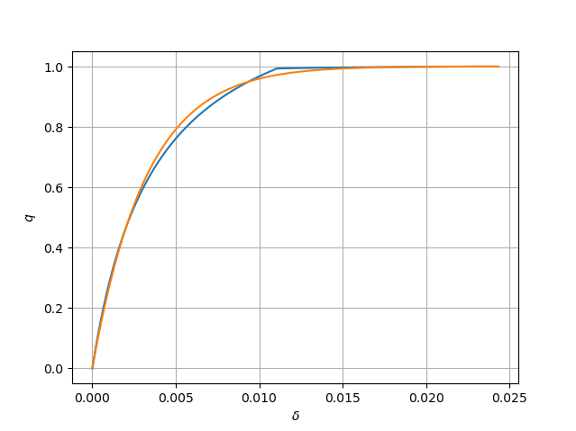
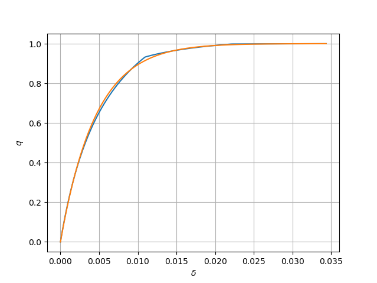

# Description
We describe the overshoot correction algorithm implemented in the simulator. For a pdf version of this document see https://hardy.uhasselt.be/Fishtest/stochastic_stopping.pdf .

Let $X$ be a random walk where the steps $S$ follow a distribution $\theta$. Assume we start in $-u$, for $u\ge 0$ and we stop when $X\ge 0$. In that case the value of $X$ is called the _overshoot_. In many cases the overshoot is undesirable.  For example in the Sequential Probability Ratio Test (SPRT) it affects the characteristics. Below we sketch a simple procedure which makes the random walk stop exactly at $0$ on average (conditioned on the random walk stopping at all, which is not automatic if $E(S)<0$).

We will do this via function $q(\delta)$ such that if we are in position $\delta$ then we  will either stop with probability $1-q(\delta)$ or continue with probability $q(\delta)$.
The requirement that on average the random walk should stop exactly at zero leads to the following condition for $q:=q(\delta)$.

$$
0=(1-q)(-\delta)+q\int_{\delta}^\infty (y-\delta) \theta(y)dy
$$

which solves to

$$
q=\frac{\delta}{\delta+\int_{\delta}^\infty (y-\delta) \theta(y)dy}
$$

If the  distribution $\theta$ is discrete then the integral in the denominator becomes of course a sum.

The quantity 
$\int_{\delta}^\infty (y-\delta) \theta(y)dy$ is interesting.
It turns out that in practice one can approximate it by replacing $\theta$ by a normal distribution
$\phi((x-\mu)/\sigma)/\sigma$ with the same variance $\sigma^2$ and expectation value $\mu$. In that case  we compute

$$
\begin{eqnarray}
\int_{\delta}^\infty (y-\delta) \theta(y)dy&\cong& \int_{\delta}^\infty\frac{y-\delta}{\sigma} \phi\left(\frac{y-\mu}{\sigma}\right) dy\\\\\\
&=&\int_{\sigma z+\mu\ge \delta}(\sigma z+\mu-\delta)\phi(z)dz\\\\\
&=&\sigma \int_{\delta_z}^\infty (z-\delta_z)\phi(z)dz
\end{eqnarray}
$$

with $\delta_z=(\delta-\mu)/\sigma$.
The standard normal distribution has the interesting property

$$
\phi'(z)=-z\phi(z)
$$

so that we obtain

$$
 \int_{\delta_z}^\infty (z-\delta_z)\phi(z)dz=\phi(\delta_z)-\delta_z(1-\Phi(\delta_z))
$$

for $\Phi$ the cumulative density function of $\phi$. So we get the final formula

$$
q\cong\frac{\delta}{\delta+\sigma(\phi(\delta_z)-\delta_z(1-\Phi(\delta_z)))}
$$

# Example
Consider the following distribution

  | probability | value |
  | ----------- | -: |
  |0.00625 | -0.0225162 |
  |0.23784 | -0.0113208 |
  |0.50951 | -0.0001254 |
  |0.23983 |  0.0110700 |
  |0.00657 |  0.0222654 |

The following graph shows both the exact value of $q$ and the approximated one.

THe next graph shows both graphs if we are only  allowed to stop every two steps.

 
